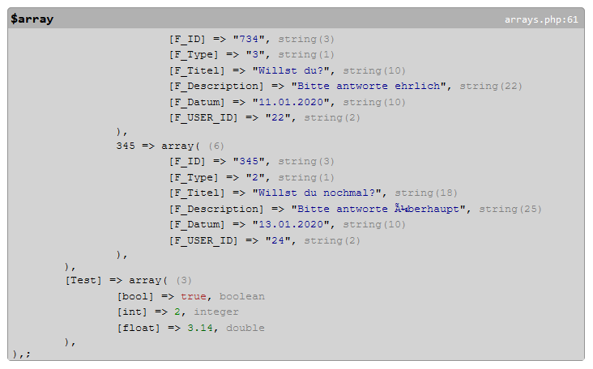

# pretty_print
little debug helper for PHP

## usage

    require_once('pretty_print.php');
    echo pprint_css();

     $array = array(
      "UID" => "382",
      "U_Titel" => "Wer wie was",
      "U_Description" => "wiso weshalb warum",
      "U_Datum" => "10.01.2020",
      "U_USER_ID" => "20",

      "Fragen" => array( 

        "734" => array(
          "F_ID" => "734",
          "F_Type" => "3",
          "F_Titel" => "Willst du?",
          "F_Description" => "Bitte antworte ehrlich",
          "F_Datum" => "11.01.2020",
          "F_USER_ID" => "22",
          ),

        "345" => array(
          "F_ID" => "345",
          "F_Type" => "2",
          "F_Titel" => "Willst du nochmal?",
          "F_Description" => "Bitte antworte überhaupt",
          "F_Datum" => "13.01.2020",
          "F_USER_ID" => "24",
          ),
      ),

      "Test" => array(
        "bool" => true,
        "int" => 2,
        "float" => 3.14,
      ),
    );

    pprint($array,1,1,0);
    pprint($array);

	
	
	
	
